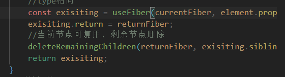
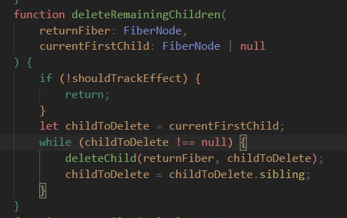
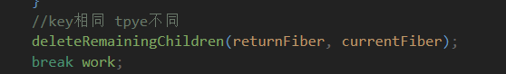

## reconcileSingleElement 有四种情况
1、key相同、type相同
A1B2C3 -> A1     可以复用

2、key相同 、 type不同 == 不存在任何复用的可能性

3、key不同 、type相同 == 当前节点不能复用

4、key不同、type不同 == 当前节点不能复用

同级多节点

ul>li*3

单节点支持：
1、插入：Placement
2、删除：childDeletion

多节点支持：
1、插入：Placement
2、删除：childDeletion
3、移动：Placement

整体流程分为4步：
1、将current中所有的同级fiber保存到Map中
2、遍历newChild数组，对于每个遍历到的element，存在两种情况：
    a、在Map中存在对应的current fiber ，且可以复用
    b、在Map中不存在对应的current fiber，或不能复用
3、判断是插入还是移动
4、最后Map中剩下的都标记删除

2、是否可以复用

首先，根据key从Map中获取current fiber 如果不存在current fiber
则没有复用的可能性

接下来，分情况讨论：
element是HostText,current fiber是吗？

element是其他ReactELement，currentFiber吗？
TODO element是数组或Fragment，currentfiber是吗？

3、插入/移动判断详解

移动的判断依据：element的index与 element对应current fiber index的比较

A1 B2 C3 -> B2 C3 A1
0  1  2     0  1  2

当遍历element时，当前遍历到的element 一定是所有已经遍历的element 中最靠右那个

所以只需要记录最后一个可以复用fiber在current中的index。在接下来的遍历中：
1、如果接下来遍历到的可复用的fiber的index < lastPlacementIndex,则标记Placement
2、否则，不标记

